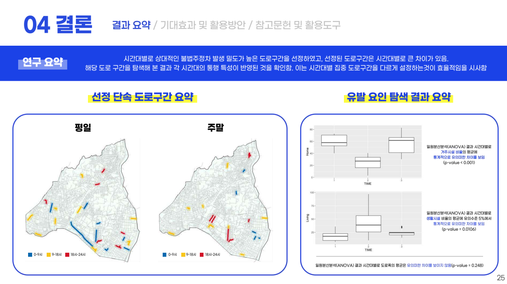

# 양다희｜GIS Data Engineer 포트폴리오

## 공간정보로 문제를 해결하는 사람, 양다희입니다.

공간 데이터를 분석하고 시스템에 적합한 구조로 전환하는 과정에 관심이 많습니다. 지도 데이터의 흐름을 파악하고, 운영 효율과 자동화를 함께 고민하며 데이터와 시스템을 연결하는 실용적 사고를 갖춘 엔지니어로 성장하고 있습니다.

# 🔎 Profile

.png)

### 경력

GOIT   2024.08 - 2024.11

• 농업 판독 데이터 시각화 및 공간 DB 구축

• 폴리곤 중심 공간 DB 정제 및 구축

• 생활권 진단 관련 공간데이터 입력 및 구조 설계

• 정확도 향상을 위한 중복/누락 판독 검수

### 자격증

ADsP    2025.03

### 학력

서울시립대학교 공간정보공학과  2021.03 - 현재

### 외국어

OPic IH    2025.01

### 수상이력

서울시 빅데이터 캠퍼스 공모전 - 우수상

공간정보 경진대회 - 우수상

# ⚒️ Skills

.png)

역량의 전문성에 따라 **상 · 중 · 하** 수준으로 분류하였습니다. 각 항목을 누르면 상세 내용을 확인할 수 있습니다. 

**Hard Skills**

- SQL
    
    심화 문법 
    
    데이터 추출 및 분석
    
- 공간 데이터 처리
    
    판독 기반 좌표 및 속성 데이터를 전처리
    
    공간 DB 구축을 위한 폴리곤 단위 정제 작업
    
- 공간 분석
    
    공간 통계 기법(KDE, 상대적 위험면, 주성분 분석 등)
    
    공간최적화 기법(MCLP, P-Median 등)
    

**Soft Skills**

- 문제 해결력
    
    프로세스 개선
    
    오류 대응
    
    자동화 제안 
    
- 꼼꼼함 및 정확함
    
    데이터 검수
    
    반복 작업 검수
    
- 자기주도 학습력
    
    공간 분석 기법 독학
    
    실무 도구 습득
    
    실무 적용
    
- 커뮤니케이션
    
    내외부 협력
    
    피드백 조율
    

**Tools**

- QGIS
    
    공간데이터 시각화 및 속성 기반 스타일링
    
    입력 데이터 오류 검수 및 레이어 편집 처리
    
    속성 편집 및 레이어 스타일링
    
- ArcGIS
    
    좌표 시각화
    
    데이터 맵핑
    
    결과 시각화
    
- Python
    
    데이터 전처리
    
    분석 자동화
    
- R
    
    공간 분석 처리
    

# 👩🏻‍💻 Projects

.png)

담당한 프로젝트를 최신순으로 구성했습니다. 각 이미지를 누르면 주요 내용 / 역할&기여도 / 기간 등을 확인할 수 있습니다.

[주요 프로젝트 포트폴리오](%E1%84%8C%E1%85%AE%E1%84%8B%E1%85%AD%20%E1%84%91%E1%85%B3%E1%84%85%E1%85%A9%E1%84%8C%E1%85%A6%E1%86%A8%E1%84%90%E1%85%B3%20%E1%84%91%E1%85%A9%E1%84%90%E1%85%B3%E1%84%91%E1%85%A9%E1%86%AF%E1%84%85%E1%85%B5%E1%84%8B%E1%85%A9%201c18168b289a81dcaf03c557a3f05ee5.csv)

# 👩🏻‍🚀 Experience

.png)

🌏 **도시미래 인재 양성 프로젝트 (2023.01.23 - 2023.02.19)**

- 이스탄불에서 한 달 간 ‘역사적 문화 자원과 도시 경쟁력’을 주제로 현장 중심 도시 인프라 탐색 및 연구 수행
- 시청, 연구소, 대학 등 기관 방문 및 인터뷰 수행으로 도시의 역사문화자원이 어떻게 경쟁력으로 작용하는지 조사
- 역사문화 자원의 공간 분포를 지도화하고, 주요 거점이 관광/지역 이미지에 미치는 영향을 분석  후 시각화

🗂 **GOIT 계약직 (2024.08.01 - 2024.11.30)**

- 남·북한 농업면적 조사 및 생활권 진단 관련 공간 데이터를 판독·구획·정리하는 작업 수행
- 업무 중 작업 효율을 높이기 위한 방식을 제안 후, 정확도와 속도를 인정받아 중요 구간 판독 작업을 우선적으로 맡아 수행
- 영상 판독 보조 자료 제작, 속성 일괄 매핑 자동화 등도 수행하며 문제 해결 중심의 GIS 업무 경험 습득

# 🙋🏻 How I work

.png)

- 데이터나 도면을 다룰 땐 실수 없이 정확하게 처리하는 걸 중요하게 생각합니다.
- 주어진 조건 안에서 할 수 있는 최선의 방식부터 빠르게 실행하려고 합니다.
- 혼자 오래 고민하기보단, 팀에 상황을 공유하고 더 나은 방법을 찾는 걸 선호합니다.
- 내가 만든 결과물이 다른 팀에 어떻게 쓰일지를 항상 먼저 확인하고 움직입니다.

# 👋 Contact

.png)

✉️ yangdahee02@naver.com   📱+82 10-6268-7145   🏠 서울 동대문구 전농로38길 99

[👆 맨 위로 올라가기](%E1%84%8B%E1%85%A3%E1%86%BC%E1%84%83%E1%85%A1%E1%84%92%E1%85%B4%EF%BD%9CGIS%20Data%20Engineer%20%E1%84%91%E1%85%A9%E1%84%90%E1%85%B3%E1%84%91%E1%85%A9%E1%86%AF%E1%84%85%E1%85%B5%E1%84%8B%E1%85%A9%201c18168b289a805985f2fc85f825dc9c.md)

# 서울시 사회문화적 요소를 고려한 스마트폴 우선입지 선정

[서울시 사회문화적 요소를 고려한 스마트폴 우선입지 선정.pdf](%EC%84%9C%EC%9A%B8%EC%8B%9C_%EC%82%AC%ED%9A%8C%EB%AC%B8%ED%99%94%EC%A0%81_%EC%9A%94%EC%86%8C%EB%A5%BC_%EA%B3%A0%EB%A0%A4%ED%95%9C_%EC%8A%A4%EB%A7%88%ED%8A%B8%ED%8F%B4_%EC%9A%B0%EC%84%A0%EC%9E%85%EC%A7%80_%EC%84%A0%EC%A0%95.pdf)

9개의 행정동 결과 중 하나를 캡쳐한 사진

**요약**

- 서울시 내 사회문화적 요소를 반영하여 스마트폴 최적 설치 위치를 도출한 공간 분석 프로젝트
- 인구, 보행량, 범죄 및 사고 밀집도 등 다양한 지표를 정량화 및 시각화해, 우선 설치 대상지를 제안

**역할**

- 2인 팀 프로젝트로 진행, 프로젝트 주제 선정과 분석 방향 제안을 직접 주도
- 공간 통계 기법 선정과 MCLP 모델 코딩, 시각화 작업 전반을 직접 수행

**성과**

- 7개 사회문화 요인을 통합한 공간 통계 모델 설계 및 최적화 모델 구현
- 서울시 내 스마트폴 설치 우선 대상지 도출
- 실제 정책 제안서 형태의 결과물로 완성
- 관련 경진대회 우수상 수상

**시기**

- 2024.03 - 2024.06

# 📝세부 내용

---

1. **개요**
- 서울시의 스마트시티 인프라 확산을 목표로, 스마트폴 설치에 앞서 우선 설치 대상지를 도출하기 위한 프로젝트
- 단순 인구나 행정구역 기준이 아닌 보행자 밀도, 범죄/사고 발생, 생활인구 등 사회문화적 요인을 반영해 정책적 우선순위가 높은 지역 선정이 핵심 목표

1. **데이터 수집 및 분석 대상**
- 스마트폴 설치 목적을 고려해, 서울시 교통사고 발생 위치, 범죄율, 유동인구, 보행자 안전지수 등 사회문화적 요소를 반영한 변수 선정
- 모든 데이터는 QGIS에서 병합 후, 시각화 및 공간 통계 분석이 가능한 구조로 전처리

1. **요인 분석 및 가중치 설정**

| 기법 | 적용 대상 | 분석 목적 |
| --- | --- | --- |
| KDE | 범되, 사고, 보행자 | 고위험 지역 및 이용 밀집도 시각화 |
| 상대적 위험도 분석 | 범죄, 인구비 | 인구대비 위험성 반영 |
| PCA | 전체 지표 | 변수 축소 및 가중치 통합 |
- 다중 기준 의사결정 기법과 공간 통계 분석을 적용하여 설치 우선순위 평가 모델 구축
- 수집 데이터는 공간 통계 기법을 활용해 지역 간 차이 정량화
- 각 지표는 밀집도, 위험도, 접근성의 관점에서 분석 후 PCA를 통해 지표 간 중복성 제거 및 통합 점수 산출에 활용
- 통합 점수는 공간 단위(행정동) 기준 계산 후 최적화 모델 입력값으로 사용

1. **최적 입지 도출 (MCLP)**
- 통합 점수 기반 입지 후보지 선별 후 MCLP 모델을 적용해 제한된 자원으로 최대한 많은 수요를 커버 가능한 위치 도출
- 행정동 단위 통합 점수 상위 지역을 설치 후보지로 설정 → 각 후보지의 커버리지 계산 → 커버리지 기준 우선 설치 대상지 선정
- 최적화 과정은 Python 기반으로 구현, 최종 결과는 QGIS에서 시각화

1. **결과 및 성과**
- 단순 지표 비교가 아닌 사회문화적 요인을 통합한 정량적 점수와 공간 최적화 알고리즘을 활용해 실제 정책에 적용 가능한 형태로 정리
- 다른 도시 적용 가능성 확보
- 추후 다양한 스마트 인프라 입지 분석으로 확장 가능
- 공간정보 경진대회 우수상 수상

[◀ 이전 페이지 돌아가기](%E1%84%8B%E1%85%A3%E1%86%BC%E1%84%83%E1%85%A1%E1%84%92%E1%85%B4%EF%BD%9CGIS%20Data%20Engineer%20%E1%84%91%E1%85%A9%E1%84%90%E1%85%B3%E1%84%91%E1%85%A9%E1%86%AF%E1%84%85%E1%85%B5%E1%84%8B%E1%85%A9%201c18168b289a805985f2fc85f825dc9c.md)

# 불법주정차 위치의 시공간적 탐색을 통한 집중 단속 도로구간 설정

[불법주정차 위치의 시공간적 탐색을 통한 집중 단속 도로구간 설정.pdf](%EB%B6%88%EB%B2%95%EC%A3%BC%EC%A0%95%EC%B0%A8_%EC%9C%84%EC%B9%98%EC%9D%98_%EC%8B%9C%EA%B3%B5%EA%B0%84%EC%A0%81_%ED%83%90%EC%83%89%EC%9D%84_%ED%86%B5%ED%95%9C_%EC%A7%91%EC%A4%91_%EB%8B%A8%EC%86%8D_%EB%8F%84%EB%A1%9C%EA%B5%AC%EA%B0%84_%EC%84%A4%EC%A0%95.pdf)

**요약**

- 서울시 불법주정차 데이터 기반으로 시공간적 패턴을 탐색하여 집중 단속 도로 구간 도출
- 현재 단속 한계를 보완하고, 시계열 분석과 공간 통계 분석을 활용해 효율적 행정 집행이 가능하도록 지원하는 것이 주요 목표

**역할**

- 2인 팀 프로젝트로 진행, 분석 기법 구현과 결과 시각화 중심의 역할을 주도적으로 수행
- 상대적 위험면 계산, 알고리즘 구현 등 분석의 기술적 실행과 설계 담당

**성과**

- 민원 건수 기준이 아닌 객관적 시공간 데이터 기반의 단속 기준 제시
- 위험도 점수 및 시각화를 통해 단속 우선 구간 도출
- 분석 결과를 행정용 보고서 형태로 정리하여 현실 적용 가능성 확보
- 서울시 빅데이터 캠퍼스 공모전 우수상 수상

**시기**

- 2023.09 - 2023.11

# 📝세부 내용

---

1. **개요**
- 서울시의 불법주정차 데이터를 바탕으로 시공간적 패턴을 정량적으로 분석하여 집중 단속 도로 구간 선정
- 기존 단속 정책의 한계를 넘어, 객관적 시계열 밀집도, 상대적 위험면 분석을 통해 효율적 단속 우선순위 로드맵 제안이 목표

1. **데이터 수집 및 분석 기준**

| 항목 | 처리 방식 |
| --- | --- |
| 공간 정제 | XY 좌표 오류 제거 및 도로 링크 기반 매칭 |
| 시간 필터링 | 요일/시간대별 밀집도 분석을 위한 시계열 구조화 |
| 중복 제거 | 동일 위치/시간 반복 신고 제거 |
| 행정단위 기준화 | 도로 링크 및 법정동 기준 단속 권역 설정 |
- 빅데이터 캠퍼스에서 제공하는 불법주정차 단속 데이터 활용
- 공간 데이터를 대상으로 공간 좌표 정제, 날짜/시간 파싱, 중복 필터링 등 수행해 분석 가능 형태로 전처리
- 불법주정차 위치의 빈도와 밀도뿐 아니라, 시간대, 요일, 위치 등을 고려해 시공간 패턴 분석의 기반 마련

1. **시공간 분석 및 위험도 계산**

| 기법 | 분석 목적 |
| --- | --- |
| 시계열 분석 | 요일/시간대별 집중 민원 발생 시간대 도출 |
| 상대적 위험도 분석 | 지역별 단속 건수/전체 비율 계산 |
| KDE | 공간 집중도 시각화 |
| 클러스터링 | 위험도 유사 지역군 그룹화 |
- 시간대/요일별 밀집도 시각화와 함께 상대적 위험도 계산을 통해 도로 구간별 단속 필요 수준 정량화
- 각 도로 구간은 시각적 지도 위에 위험도 점수로 표현
- 단속 자원이 한정된 상황에서 효율적 우선 설정이 가능하도록 단속 우선도 수치화

1. **집중 단속 구간 선정 및 결과**
- 상대적 위험도 분석과 클러스터링 결과 바탕으로, 단속 우선순위가 높은 도로 구간 선정
- 위험도 점수 상위 10%, 시간 집중성, 밀도를 선정 기준으로 설정
- 도출된 대상지는 위험도 맵, 근거 지표 등과 함께 시각화

1. **결과 및 성과**
- 실제 단속 전략 수립에 활용 가능한 정책 제안서 형태로 완성
- 기존 불법주정차 단속 한계를 넘어 데이터 기반 우선순위 정책의 가능성 제시
- 빅데이터 캠퍼스 공모전 우수상 수상

[◀ 이전 페이지 돌아가기](%E1%84%8B%E1%85%A3%E1%86%BC%E1%84%83%E1%85%A1%E1%84%92%E1%85%B4%EF%BD%9CGIS%20Data%20Engineer%20%E1%84%91%E1%85%A9%E1%84%90%E1%85%B3%E1%84%91%E1%85%A9%E1%86%AF%E1%84%85%E1%85%B5%E1%84%8B%E1%85%A9%201c18168b289a805985f2fc85f825dc9c.md)
